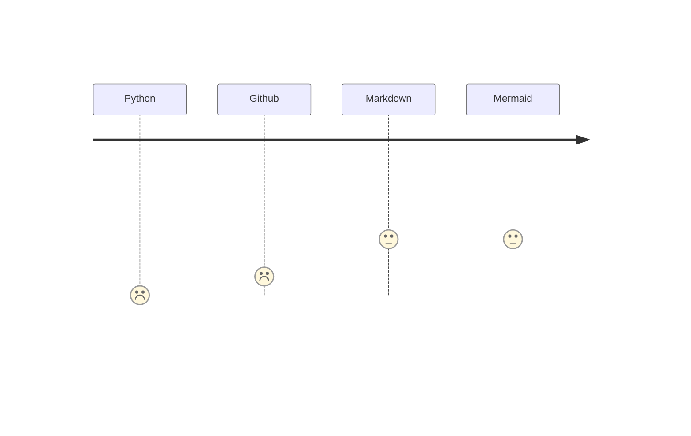

#### Who am I?
I am sith-source/sithsource 😄  
More to come later (maybe) 😇

#### Why:
- After many years as a solution architect/business analyst/subject matter expert, looking at data, helping developers with logic issues, and designing applications and integrations, now its my turn to take the next step in my career.
- I wanna become a developer, that is trusted by peers and users.
- The dream is to create tools used by many, but not at the expense of quality of the tools.

#### How:
- I will focus on a few things to begin with.
* Python - 🔗 https://www.python.org/ - to build the tools needed.
* Github - 🔗 https://github.com/ - for CICD/version control.
* Markdown - 🔗 https://www.markdownguide.org/ - for documentation.
* Mermaid - 🔗 https://mermaid.js.org/ - for graphical overview of apps all be building.

#### Progress:
- Python: will begin with Automate the boring stuff 3rd edition release.
    - will focus on the basics first, long term I would like to be able to use modules like: 
        - black, for formatting code
        - dotenv/pipenv, for controling enviroment configurations
        - requests/httpx, for integration towards other applications
        - duckdb. for data 
        - pytest, for test 
        
    - I have been looking at what I want to do with python for a while, hence I have come up with the above. This will properbly change as a learn more.

- Github: ongoing, as you can see by reading this on Github.
    - I currently use it mostly for "backup" of different SQL quries, that I have created, but need to learn alot more of it later.
- Markdown: ongoing, as you can see by this markdown file.
- Mermaid: ongoing, as you can see in below demo.
    - I have been using plantuml for a long time, but started swapping to mermaid, as it is more lightweight and can be rendered directly in markdown.

  
Contact details

  Might be added later.

#### The only contant is change
- People change.
- Business changes.
- Laws change.
- You must learn to adapt.
